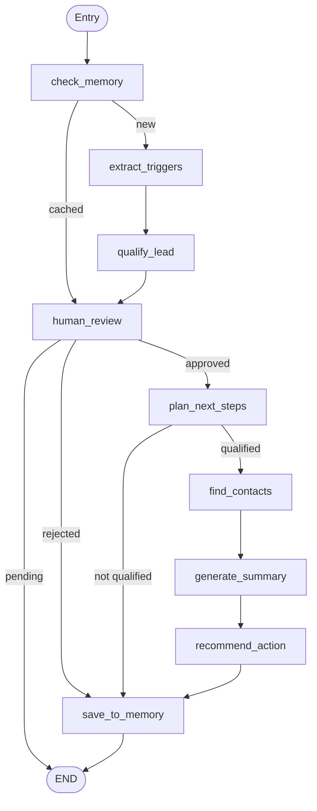

# Architecture

## LangGraph Flow

## Shared Memory

The `MemoryStore` (in `app/tools/memory.py`) uses Redis when available, falling back to an in-memory dictionary when the `redis` package is not installed. This design prevents duplicate work:

- **Before scraping**, `check_memory` looks up `company_url` in the store. If a profile exists, the graph skips directly to `human_review`, avoiding a re-scrape and re-qualification.
- **After completion**, `save_to_memory` persists the full result (raw content, triggers, score, contacts, summary, recommended action) keyed by company URL.
- **History** is surfaced in the Streamlit History tab via `get_all_profiles()`.

This means running the same company URL twice is nearly instantaneous on the second run.

## Dynamic Planner

The `plan_next_steps` node in `app/agents/planner_agent.py` inspects `extracted_triggers` for specific types and appends context-aware actions:

| Trigger Type     | Action Added               |
|------------------|----------------------------|
| `hiring`         | `draft_hiring_outreach`    |
| `funding`        | `draft_investment_congrats` |

The planner only emits actions when `approval_status == "approved"`. The base actions (`find_contacts`, `generate_summary`) are always added for qualified leads.

## Human-in-the-Loop (HITL)

After qualification the graph pauses at `human_review`. The Streamlit UI presents three choices:

1. **Approve & Enrich** – sets `approval_status = "approved"`, continues through planner, contacts, summary, and action recommendation.
2. **Reject** – sets `approval_status = "rejected"`, saves to memory and ends.
3. **Edit ICP** – calls `qualify_lead` locally with edited criteria, updates the pending state in session, and re-displays the approval prompt.

This two-phase invocation pattern (phase 1 = analysis, phase 2 = enrichment) is managed through Streamlit session state (`pending_result` / `final_result`).
